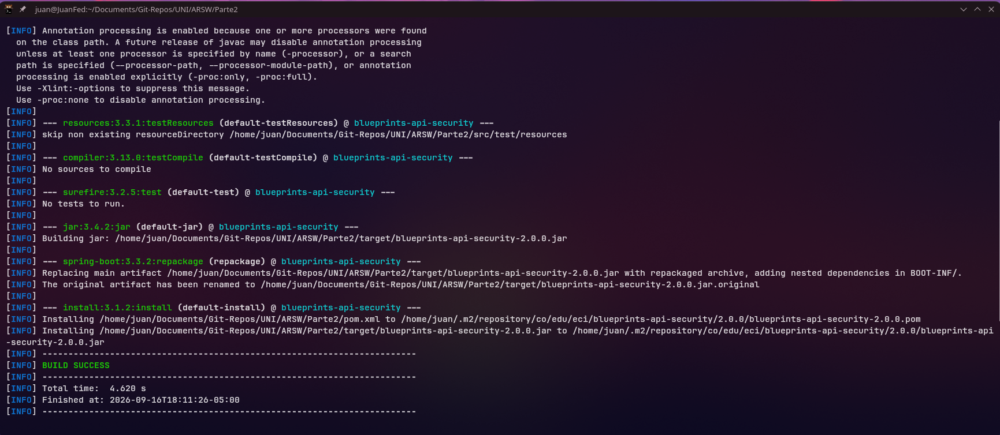
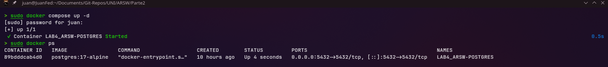
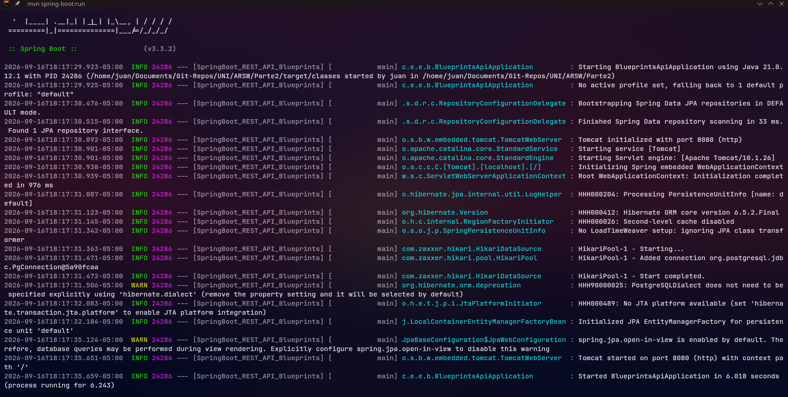
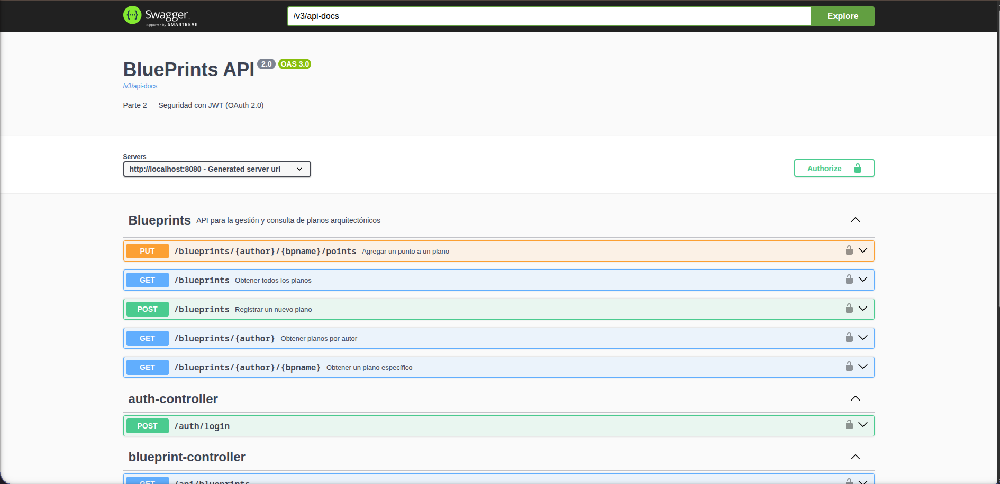
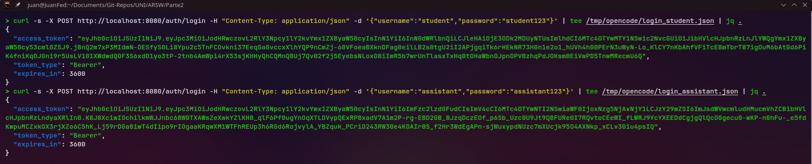
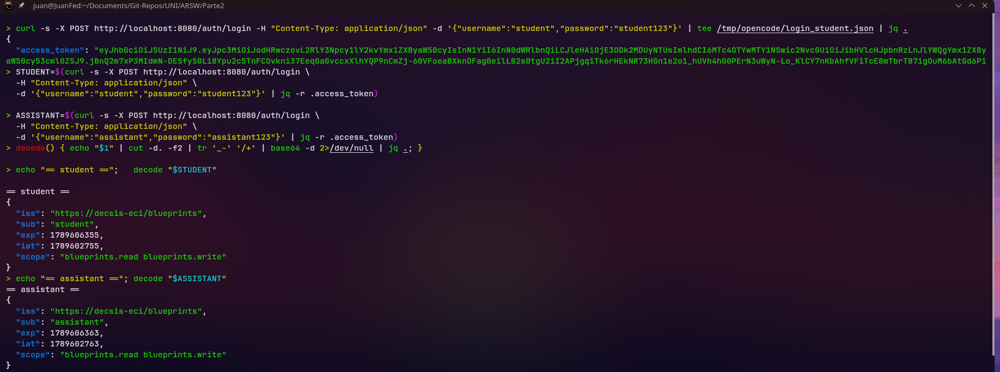
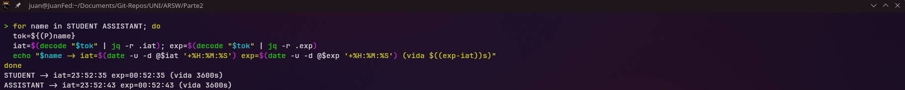

# Actividades propuestas 

1. Revisar el código de configuración de seguridad (SecurityConfig) e identificar cómo se definen los endpoints públicos y protegidos.

2. Explorar el flujo de login y analizar las claims del JWT emitido.

3. Extender los scopes (blueprints.read, blueprints.write) para controlar otros endpoints de la API, del laboratorio P1 trabajado.

4. Modificar el tiempo de expiración del token y observar el efecto.

5. Documentar en Swagger los endpoints de autenticación y de negocio.

--- 

## Actividad 1  

El sistema de seguridad de la aplicación está gestionado mediante Spring Security (`SecurityConfig.java`), implementando un Resource Server basado en OAuth2/JWT.

### Mapeo de Endpoints

Las reglas de control de acceso se dividen en tres categorías principales:

- **Públicos (Acceso libre):**
    - Monitoreo: `/actuator/health`
    - Autenticación: `/auth/login`
    - Documentación: `/v3/api-docs/**`, `/swagger-ui/**`, `/swagger-ui.html`
- **Protegidos por Scopes (`/api/**`):** Requieren que el token JWT contenga el scope `SCOPE_blueprints.read` **o** `SCOPE_blueprints.write`.
- **Protegidos por Autenticación (Regla por defecto):** Cualquier otra solicitud (incluyendo rutas como `/blueprints/**`) requiere un token válido (`authenticated()`), pero no exige un scope específico.

---

### Hallazgos y Puntos de Atención

Durante la revisión de la configuración, se identificaron dos comportamientos arquitectónicos importantes:

#### 1. Riesgo de Sobre-privilegio en `/api/**`
Actualmente, un usuario cuyo token **solo** tiene el permiso `blueprints.read` puede ejecutar operaciones de escritura (POST, PUT, DELETE) con éxito.

**¿Por qué sucede?**
La regla `.requestMatchers("/api/**").hasAnyAuthority("SCOPE_blueprints.read", "SCOPE_blueprints.write")` no distingue entre métodos HTTP. Al usar `hasAnyAuthority` (que actúa como un operador lógico `OR`), cualquiera de los dos permisos otorga acceso total a todas las operaciones sobre esos endpoints.

#### 2. Ignorancia de la propiedad `jwk-set-uri`
La configuración en el archivo `application.yml` (`spring.security.oauth2.resourceserver.jwt.jwk-set-uri`) es ignorada en la práctica por la aplicación.

**¿Por qué sucede?**
Spring Boot utiliza autoconfiguración, pero da prioridad a los Beans explícitos definidos en el código. Al existir un `@Bean` de tipo `JwtDecoder` en `SecurityConfig.java` que utiliza una clave inyectada localmente (`JwtKeyProvider`), Spring descarta la URL del `application.yml` y usa exclusivamente la configuración local en memoria.

--- 

## Actividad 2 — Flujo de login y claims del JWT

Lo primero que haremos será compilar el proyecto y verificar que todas las dependencias y pruebas se ejecuten correctamente usando el comando `mvn clean install`:



Después de esto, levantamos los contenedores de Docker para iniciar la base de datos PostgreSQL:



Una vez que la base de datos está lista, ejecutamos la aplicación, la cual quedará escuchando en el puerto local 8080:



Esto nos permitirá verificar que el servicio está arriba y acceder a la interfaz desde el navegador:



### Análisis del Payload del JWT

Para entender qué sucede realmente por debajo con la autenticación de los diferentes usuarios (`student` y `assistant`), realizamos peticiones mediante `curl` al endpoint `/auth/login`. Luego, extraemos y decodificamos el payload de sus respectivos tokens JWT para analizar sus *claims*:







**Lo que podemos observar detalladamente en estas capturas es lo siguiente:**

1. **Emisor e Identidad (`iss` y `sub`):** El sistema identifica correctamente a cada usuario (`sub` es `student` o `assistant` según corresponda). Además, vemos que el emisor (`iss`) no es un valor por defecto, sino que está configurado con la URL específica de la API (`"https://decsis-eci/blueprints"`).
2. **Tiempo de Vida (`iat` y `exp`):** Al procesar las fechas de emisión y expiración, el script de la terminal nos confirma matemáticamente que los tokens tienen un tiempo de vida (TTL) configurado de exactamente **3600 segundos (1 hora)**.
3. **Falla de Diseño en los Permisos (`scope`):** El hallazgo más crítico es que el sistema asigna **exactamente los mismos privilegios** a ambas cuentas. Tanto el estudiante como el asistente reciben el permiso `"blueprints.read blueprints.write"`. Esto evidencia un problema de diseño, ya que no existe una verdadera segregación de roles que impida a un estudiante modificar registros.

--- 

## Actividad 3 — Extender scopes a los endpoints de negocio

Para solucionar la vulnerabilidad de sobreprivilegio identificada anteriormente, implementamos una estrategia de Control de Acceso Basado en Roles (RBAC) modificando tanto la asignación de permisos como la protección de los recursos.

### 1. Asignación Diferenciada de Permisos
El primer paso fue corregir la clase `InMemoryUserService` para que el proveedor de identidad asigne permisos (`scopes`) acordes al perfil de cada usuario en el momento de emitir el JWT:
- El usuario `student` ahora recibe únicamente el scope `blueprints.read`.
- El usuario `assistant` recibe ambos scopes: `blueprints.read` y `blueprints.write`.

```java
package co.edu.eci.blueprints.security;

import org.springframework.security.crypto.password.PasswordEncoder;
import org.springframework.stereotype.Service;
import java.util.Map;

@Service
public class InMemoryUserService {
    private final Map<String, String> users;
    private final Map<String, String> userScopes; 
    private final PasswordEncoder encoder;

    public InMemoryUserService(PasswordEncoder encoder) {
        this.encoder = encoder;
        this.users = Map.of(
            "student", encoder.encode("student123"),
            "assistant", encoder.encode("assistant123")
        );
        
        // Parte nueva agregada para hacer uso de RBAC. 
        this.userScopes = Map.of(
            "student", "blueprints.read",
            "assistant", "blueprints.read"
        );
    }

    public boolean isValid(String username, String rawPassword) {
        String hash = users.get(username);
        return hash != null && encoder.matches(rawPassword, hash);
    }
}
```


### 2. Protección a Nivel de Método (@PreAuthorize)
Aunque las reglas generales de enrutamiento se definen en `SecurityConfig`, la autorización detallada de las operaciones de negocio se delegó a la capa de controladores.

Dado que la aplicación cuenta con `@EnableMethodSecurity`, decidimos aplicar el control de acceso directamente en los *handlers* de `BlueprintsAPIController`, lo que permite un control más granular:

- **Operaciones de Lectura (GET):** Se protegieron con `@PreAuthorize("hasAuthority('SCOPE_blueprints.read')")`.
- **Operaciones de Escritura (POST, PUT):** Se protegieron con `@PreAuthorize("hasAuthority('SCOPE_blueprints.write')")`.

### 3. Verificación de Seguridad (Pruebas de Acceso)
Para comprobar la correcta implementación del modelo de seguridad, se ejecutaron las siguientes pruebas:

1. **Generación de Token (Student):** Se obtuvo el `access_token` del usuario `student`. Al decodificar el payload, se verificó que el claim `scope` es exclusivamente `"blueprints.read"`.
2. **Prueba de Lectura (Éxito):** Al realizar una petición `GET /blueprints` con el token del estudiante, el servidor responde correctamente con HTTP `200 OK`.
3. **Prueba de Escritura (Bloqueo):** Al intentar ejecutar un `POST /blueprints` con el mismo token del estudiante, el servidor deniega la operación y devuelve un HTTP `403 Forbidden`, confirmando que el endpoint de escritura está blindado contra usuarios no autorizados.

